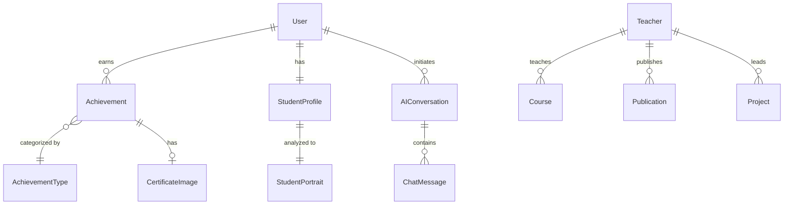

# 学生综合信息服务平台 - 前端功能模块说明文档（核心版）

## 📋 文档概述

本文档面向后端工程师，详细说明学生综合信息服务平台前端的**核心功能模块**、页面结构、数据流转和所需的后端 API 接口。本文档聚焦于系统最重要的功能模块，帮助后端团队优先设计并实现核心业务接口。

### 系统基本信息

- **前端技术栈**: Vue 3 + TypeScript + Naive UI
- **数据格式**: JSON
- **认证方式**: JWT Token (Bearer Authentication)
- **API 基础路径**: `/api`
- **后端系统**: Strapi v5 CMS

---

## 🔐 1. 用户认证模块 【P0 - 核心】

### 1.1 登录页面

**路由**: `/login`  
**组件**: `components/student/login/LoginPage.vue`

#### 功能说明
- 用户通过学号/邮箱 + 密码登录系统
- 登录成功后获取 JWT Token 并存储在 localStorage
- 自动跳转到仪表盘页面
- 实现路由守卫，未登录用户自动重定向到登录页

#### 所需接口

##### 1.1.1 用户登录 ⭐
```
POST /api/auth/local
```

**请求体**:
```typescript
{
  identifier: string  // 学号或邮箱
  password: string    // 密码
}
```

**响应**:
```typescript
{
  jwt: string        // JWT Token
  user: {
    id: number
    username: string
    email: string
    role?: {
      id: number
      name: string
      description?: string
      type?: string
    }
  }
}
```

**状态码**:
- `200 OK` - 登录成功
- `400 Bad Request` - 参数错误
- `401 Unauthorized` - 用户名或密码错误

---

##### 1.1.2 获取当前用户信息 ⭐
```
GET /api/users/me
```

**请求头**: 
```
Authorization: Bearer {jwt_token}
```

**响应**:
```typescript
{
  id: number
  username: string
  email: string
  confirmed: boolean
  blocked: boolean
  role?: {
    id: number
    name: string
    description?: string
    type?: string
  }
  createdAt?: string
  updatedAt?: string
}
```

**状态码**:
- `200 OK` - 成功获取用户信息
- `401 Unauthorized` - Token 无效或过期

---

##### 1.1.3 退出登录
```
POST /api/auth/logout
```

**请求头**: 
```
Authorization: Bearer {jwt_token}
```

**响应**:
```typescript
{
  success: boolean
}
```

**说明**: 前端会清除 localStorage 中的 Token

---

##### 1.1.4 刷新 Token
```
POST /api/auth/refresh
```

**请求头**: 
```
Authorization: Bearer {jwt_token}
```

**响应**:
```typescript
{
  jwt: string
}
```

**说明**: 
- Token 有效期建议为 7 天
- 当 Token 即将过期时自动调用此接口刷新

---

## 🏠 2. 仪表盘模块

### 2.1 学生仪表盘

**路由**: `/student/dashboard`  
**组件**: `components/student/dashboard/DashboardPage.vue`

#### 功能说明
- 展示学生个人信息概览
- 显示关键数据统计（课程、作业、荣誉等）
- 提供快捷入口到各功能模块
- 显示最新通知和待办事项

#### 所需接口

##### 2.1.1 获取学生统计数据
```
GET /api/students/statistics
```

**请求头**: 
```
Authorization: Bearer {jwt_token}
```

**响应**:
```typescript
{
  statistics: {
    coursesCount: number           // 课程总数
    assignmentsCount: number       // 作业总数
    completedAssignments: number   // 已完成作业数
    achievementsCount: number      // 荣誉总数
    averageScore?: number          // 平均成绩
    pendingTasks?: number          // 待办任务数
  }
}
```

---

##### 2.1.2 获取学生档案信息
```
GET /api/students/profile
```

**请求头**: 
```
Authorization: Bearer {jwt_token}
```

**响应**:
```typescript
{
  profile: {
    name: string
    studentId: string
    major: string
    grade: string
    college: string
    phone?: string
    avatar?: string
    email?: string
  }
}
```

---

### 2.2 数据可视化大屏

**路由**: `/student/stastic` 或 `/student/data-screen`  
**组件**: `components/student/stastic/data-screen.vue`

#### 功能说明
- 多维度数据的可视化展示
- 使用 ECharts 绘制统计图表
- 展示成绩趋势、荣誉分布、学习时间等

#### 所需接口
- 复用 `/api/students/statistics` 接口
- 可能需要额外的细分统计接口（根据具体图表需求）

---

## 🏆 3. 荣誉成就模块 【P1 - 重要】

### 3.1 荣誉列表页

**路由**: `/student/achievement`  
**组件**: `components/student/honors/achievement.vue`

#### 功能说明
- 展示学生的所有荣誉成就
- 按类型、年份、级别分类展示
- 支持添加、编辑、删除荣誉
- 荣誉卡片展示（包含证书图片预览）

#### 所需接口

##### 3.1.1 获取荣誉列表 ⭐
```
GET /api/achievements
```

**请求头**: 
```
Authorization: Bearer {jwt_token}
```

**查询参数**:
```
?pagination[page]=1
&pagination[pageSize]=10
&filters[type_id][$eq]=scholarship
&filters[year][$eq]=2024
&filters[level][$eq]=国家级
&filters[status][$eq]=1
&sort[0]=awardedAt:desc
```

**响应**:
```typescript
{
  data: [
    {
      id: number
      title: string                // 荣誉名称
      description: string          // 荣誉描述
      awardedAt: string           // 获奖日期 (ISO 8601)
      type_id: string             // 荣誉类型ID
      year: string                // 获奖年份
      level: string               // 级别 (国家级/省级/校级等)
      status: number              // 状态 (0-草稿, 1-已发布, 2-已删除)
      organization?: string       // 颁发机构
      certificate?: {             // 证书图片
        id: number
        name: string
        url: string
        formats?: {
          thumbnail: { url: string }
          medium: { url: string }
        }
      }
      createdAt: string
      updatedAt: string
    }
  ]
  meta: {
    pagination: {
      page: number
      pageSize: number
      pageCount: number
      total: number
    }
  }
}
```

**状态码**:
- `200 OK` - 成功获取列表
- `401 Unauthorized` - 未授权

---

##### 3.1.2 获取荣誉详情 ⭐
```
GET /api/achievements/{id}
```

**请求头**: 
```
Authorization: Bearer {jwt_token}
```

**查询参数**:
```
?includeDeleted=true              // 可选，是否包含已删除的记录
```

**响应**:
```typescript
{
  data: {
    id: number
    title: string
    description: string
    awardedAt: string
    type_id: string
    year: string
    level: string
    status: number
    organization?: string
    certificate?: {
      id: number
      name: string
      url: string
      mime: string
      size: number
    }
    createdAt: string
    updatedAt: string
  }
  meta?: any
}
```

**状态码**:
- `200 OK` - 成功获取详情
- `404 Not Found` - 荣誉不存在
- `401 Unauthorized` - 未授权

---

### 3.2 荣誉收藏页（添加荣誉）

**路由**: `/student/achievement-collect`  
**组件**: `components/student/honors/achievement-collect.vue`

#### 功能说明
- 添加新的荣誉成就记录
- 填写荣誉信息表单（标题、描述、类型、年份、级别等）
- 上传证书图片（支持 JPG/PNG，最大 5MB）
- 表单验证和错误提示

#### 所需接口

##### 3.2.1 添加荣誉 ⭐
```
POST /api/achievements
```

**请求头**: 
```
Authorization: Bearer {jwt_token}
Content-Type: multipart/form-data
```

**请求体** (multipart/form-data):
```typescript
{
  title: string                   // 必填
  description: string             // 必填
  type_id: string                 // 必填，荣誉类型ID
  year: string                    // 必填，获奖年份
  level: string                   // 必填，级别
  awardedAt?: string             // 可选，获奖日期
  organization?: string          // 可选，颁发机构
  certificate?: File             // 可选，证书图片文件
}
```

**响应**:
```typescript
{
  data: {
    id: number
    title: string
    type_id: string
    status: number
    createdAt: string
  }
}
```

**状态码**:
- `201 Created` - 成功创建
- `400 Bad Request` - 参数错误
- `401 Unauthorized` - 未授权

---

##### 3.2.2 更新荣誉 ⭐
```
PUT /api/achievements/{id}
```

**请求头**: 
```
Authorization: Bearer {jwt_token}
Content-Type: multipart/form-data
```

**请求体** (multipart/form-data):
```typescript
{
  title?: string
  description?: string
  type_id?: string
  year?: string
  level?: string
  awardedAt?: string
  organization?: string
  certificate?: File             // 新证书图片会替换旧图片
}
```

**响应**:
```typescript
{
  data: {
    id: number
    title: string
    type_id: string
    status: number
    updatedAt: string
  }
}
```

**状态码**:
- `200 OK` - 更新成功
- `400 Bad Request` - 参数错误
- `404 Not Found` - 荣誉不存在
- `401 Unauthorized` - 未授权

---

##### 3.2.3 删除荣誉 ⭐
```
DELETE /api/achievements/{id}
```

**请求头**: 
```
Authorization: Bearer {jwt_token}
```

**响应**:
```typescript
{
  success: boolean
}
```

**说明**: 
- 可以是软删除（status 设为 2）或硬删除
- 建议使用软删除以保留数据

**状态码**:
- `200 OK` - 删除成功
- `404 Not Found` - 荣誉不存在
- `401 Unauthorized` - 未授权

---

### 3.3 荣誉详情页

**路由**: `/student/achievement-detail/:id`  
**组件**: `components/student/honors/AchievementDetail.vue`

#### 功能说明
- 查看荣誉详细信息
- 展示证书图片（支持放大查看）
- 编辑或删除荣誉
- 分享荣誉到社交平台

#### 所需接口
- 复用 `GET /api/achievements/{id}`

---

### 3.4 荣誉设置页

**路由**: `/student/achievement-settings`  
**组件**: `components/student/honors/AchievementSettings.vue`

#### 功能说明
- 配置荣誉展示偏好
- 管理荣誉分类
- 设置隐私选项

#### 所需接口

##### 3.4.1 获取荣誉类型列表
```
GET /api/achievement-types
```

**响应**:
```typescript
{
  data: [
    {
      id: string
      name: string
      description?: string
      icon?: string
    }
  ]
}
```

**常见荣誉类型**:
- `scholarship` - 奖学金
- `competition` - 竞赛奖项
- `certificate` - 技能认证
- `social_practice` - 社会实践
- `academic` - 学术成果

---

### 3.5 证书 OCR 识别 【P2 - 高级功能】

**路由**: `/student/certificate-ocr`  
**组件**: `components/student/honors/CertificateOcr.vue`

#### 功能说明
- 上传证书图片（拍照或从相册选择）
- 自动识别证书信息（OCR）
- 提取荣誉数据并自动填充表单
- 支持手动校正识别结果
- 一键保存到荣誉列表

#### 所需接口

##### 3.5.1 证书 OCR 识别 ⭐
```
POST /api/ocr/certificate
```

**请求头**: 
```
Authorization: Bearer {jwt_token}
Content-Type: multipart/form-data
```

**请求体** (multipart/form-data):
```typescript
{
  image: File                    // 证书图片（JPG/PNG，最大 10MB）
  ocr_mode?: string             // 可选，识别模式（'fast' | 'accurate'）
}
```

**响应**:
```typescript
{
  data: {
    title: string               // 识别的证书名称
    awardedAt: string          // 识别的获奖日期 (ISO 8601)
    level?: string             // 识别的级别
    organization: string       // 识别的颁发机构
    year: string               // 识别的年份
    type_id?: string           // 推荐的荣誉类型ID
    confidence: number         // 识别置信度 (0-1)
    raw_text: string           // 原始识别文本
    structured_data?: {        // 结构化数据
      recipient_name?: string
      award_name?: string
      date?: string
      issuer?: string
    }
  }
}
```

**状态码**:
- `200 OK` - 识别成功
- `400 Bad Request` - 图片格式不支持或文件过大
- `422 Unprocessable Entity` - 图片质量不佳，无法识别
- `401 Unauthorized` - 未授权

**技术要求**:
- 支持旋转校正
- 支持多语言识别（中英文）
- 识别准确率应达到 85% 以上
- 处理时间应在 3 秒内

---

## 👨‍🏫 4. 教师信息模块

### 4.1 教师列表页

**路由**: `/student/teachers` 或 `/student/teacher-info`  
**组件**: `components/student/teachers/teachers.vue`

#### 功能说明
- 展示全校教师列表
- 支持按学院、职称、研究方向筛选
- 查看教师详细信息
- 查看教师是否招收学生

#### 所需接口

##### 4.1.1 获取教师列表
```
GET /api/teachers
```

**请求头**: 
```
Authorization: Bearer {jwt_token}
```

**查询参数**:
```
?pagination[page]=1
&pagination[pageSize]=10
&filters[department][$eq]=计算机学院
&filters[title][$eq]=Professor
&filters[recruiting][$eq]=true
&sort[0]=rating:desc
```

**响应**:
```typescript
{
  data: [
    {
      id: number
      name: string
      title: 'Lecturer' | 'Professor'
      department: string
      avatar?: string | string[]
      researchcontent: string
      research_direction?: string
      studentCount?: number
      student_type?: string
      rating?: number
      className?: string
      current_courses?: string
      office_location?: string
      office_hours?: string
      recruiting: boolean         // 是否招收学生
      contactEmail?: string
      contactPhone?: string
    }
  ]
  meta: {
    pagination: {
      page: number
      pageSize: number
      pageCount: number
      total: number
    }
  }
}
```

**状态码**:
- `200 OK` - 成功获取列表

---

### 4.2 教师详情页

**路由**: `/student/teacher-detail/:id`  
**组件**: `components/student/teachers/TeacherDetail.vue`

#### 功能说明
- 查看教师详细信息
- 显示研究方向和学术成果
- 查看办公时间和联系方式
- 查看在教课程列表

#### 所需接口

##### 4.2.1 获取教师详情
```
GET /api/teachers/{id}
```

**请求头**: 
```
Authorization: Bearer {jwt_token}
```

**响应**:
```typescript
{
  data: {
    id: number
    name: string
    title: 'Lecturer' | 'Professor'
    department: string
    avatar?: string | string[]
    researchContent: string
    research_direction?: string
    studentCount?: number
    student_type?: string
    rating?: number
    className?: string
    current_courses?: string
    office_location?: string
    office_hours?: string
    recruiting: boolean
    contactEmail?: string
    contactPhone?: string
    publications?: Array<{         // 学术成果
      title: string
      year: string
      journal?: string
    }>
    projects?: Array<{             // 科研项目
      name: string
      description: string
      status: string
    }>
  }
}
```

**状态码**:
- `200 OK` - 成功获取详情
- `404 Not Found` - 教师不存在

---

## 🤖 5. AI 智能分析模块 【P2 - 高级功能】

### 5.1 学生画像分析

**路由**: `/student/portrait`  
**组件**: `components/student/portrait/portrait-analysis.vue`

#### 功能说明
- 展示学生学习数据分析
- 生成个性化学习画像
- 提供数据可视化（使用 ECharts）
- 显示学习建议和发展方向

#### 所需接口

##### 5.1.1 获取学生画像数据
```
GET /api/student-portraits/analysis
```

**请求头**: 
```
Authorization: Bearer {jwt_token}
```

**查询参数**:
```
?student_id={student_id}          // 可选，默认为当前登录学生
```

**响应**:
```typescript
{
  data: {
    student_id: string
    learning_style: string         // 学习风格
    strengths: string[]           // 优势领域
    weaknesses: string[]          // 待提升领域
    interests: string[]           // 兴趣方向
    performance_trend: {          // 成绩趋势
      labels: string[]            // 时间标签
      scores: number[]            // 成绩数据
    }
    achievement_distribution: {   // 荣誉分布
      [type: string]: number
    }
    recommendations: string[]     // 个性化建议
    career_suggestions: string[]  // 职业发展建议
    generated_at: string
  }
}
```

**状态码**:
- `200 OK` - 成功获取分析数据
- `404 Not Found` - 学生不存在

---

### 5.2 AI 对话咨询

**路由**: `/student/portrait/ai-chat`  
**组件**: `components/student/portrait/ai-chat.vue`

#### 功能说明
- 与 AI 助手进行自然对话
- 获取学习建议和问题解答
- 基于学生数据的个性化回答
- 支持多轮对话和上下文理解
- 显示对话历史记录

#### 所需接口

##### 5.2.1 发送 AI 对话消息 ⭐
```
POST /api/student-portraits/chat
```

**请求头**: 
```
Authorization: Bearer {jwt_token}
Content-Type: application/json
```

**请求体**:
```typescript
{
  question: string              // 用户问题
  student_id: string           // 学生ID
  context?: string             // 对话上下文（前几轮对话）
  session_id?: string          // 会话ID（用于多轮对话）
}
```

**响应**:
```typescript
{
  data: {
    response: string            // AI 回答
    timestamp: string
    student_id: string
    session_id: string          // 会话ID
    suggestions?: string[]      // 关联建议
    error?: boolean
    error_message?: string
  }
}
```

**状态码**:
- `200 OK` - 成功获取 AI 回复
- `400 Bad Request` - 问题为空或格式错误
- `429 Too Many Requests` - 请求过于频繁
- `500 Internal Server Error` - AI 服务异常

**技术要求**:
- 响应时间应在 3 秒内
- 支持流式输出（可选）
- 实现请求限流（每用户每分钟最多 10 次）

---

##### 5.2.2 获取对话历史
```
GET /api/student-portraits/chat/history
```

**请求头**: 
```
Authorization: Bearer {jwt_token}
```

**查询参数**:
```
?session_id={session_id}
&limit=20                       // 可选，返回数量限制
```

**响应**:
```typescript
{
  data: [
    {
      id: string
      question: string
      response: string
      timestamp: string
      session_id: string
    }
  ]
}
```

---

##### 5.2.3 查询学生信息（AI 辅助）
```
POST /api/query-student-info
```

**请求头**: 
```
Authorization: Bearer {jwt_token}
Content-Type: application/json
```

**请求体**:
```typescript
{
  question: string              // 自然语言查询
  student_id?: string          // 可选，默认为当前登录学生
}
```

**响应**:
```typescript
{
  data: {
    response: string            // 查询结果（自然语言）
    structured_data?: {         // 结构化数据
      courses?: any[]
      achievements?: any[]
      scores?: any[]
    }
    timestamp: string
    error?: boolean
    error_message?: string
  }
}
```

**示例查询**:
- "我的平均成绩是多少？"
- "我有哪些荣誉？"
- "我这学期有几门课？"

**状态码**:
- `200 OK` - 成功查询
- `400 Bad Request` - 查询无效

---

## 🔧 6. 通用技术要求

### 6.1 认证与授权

#### 请求头规范
所有需要认证的接口都应在请求头中包含 JWT Token：
```
Authorization: Bearer {jwt_token}
```

#### Token 管理
- **Token 有效期**: 建议 7 天
- **刷新机制**: 前端在 Token 即将过期时自动调用刷新接口
- **失效处理**: Token 失效时返回 401，前端自动跳转到登录页

---

### 6.2 分页参数

使用 Strapi 标准分页格式：
```
?pagination[page]=1              # 页码（从 1 开始）
&pagination[pageSize]=10         # 每页数量
```

**默认值**:
- `page`: 1
- `pageSize`: 10

---

### 6.3 过滤与排序

#### 过滤语法
```
?filters[field][$eq]=value           # 等于
?filters[field][$ne]=value           # 不等于
?filters[field][$contains]=value     # 包含
?filters[field][$gt]=value           # 大于
?filters[field][$gte]=value          # 大于等于
?filters[field][$lt]=value           # 小于
?filters[field][$lte]=value          # 小于等于
?filters[field][$in][0]=value1       # 在列表中
?filters[field][$in][1]=value2
```

#### 排序语法
```
?sort[0]=field:asc                   # 升序
?sort[0]=field:desc                  # 降序
?sort[0]=field1:asc&sort[1]=field2:desc  # 多字段排序
```

---

### 6.4 错误处理

#### 标准错误响应格式
```typescript
{
  error: {
    status: number                   // HTTP 状态码
    name: string                     // 错误名称
    message: string                  // 错误消息（用户友好）
    details?: any                    // 详细信息（开发调试用）
  }
}
```

#### 常见 HTTP 状态码
- `200 OK` - 请求成功
- `201 Created` - 资源创建成功
- `400 Bad Request` - 请求参数错误
- `401 Unauthorized` - 未授权，Token 无效或过期
- `403 Forbidden` - 权限不足
- `404 Not Found` - 资源不存在
- `422 Unprocessable Entity` - 语义错误（如 OCR 识别失败）
- `429 Too Many Requests` - 请求过于频繁
- `500 Internal Server Error` - 服务器内部错误
- `503 Service Unavailable` - 服务暂时不可用

---

### 6.5 文件上传

#### 支持的文件类型
- **图片**: JPG, PNG, GIF (最大 5MB)
- **文档**: PDF, DOC, DOCX (最大 10MB)

#### 上传格式
使用 `multipart/form-data` 格式上传文件

#### 文件响应格式
```typescript
{
  id: number
  name: string
  url: string                      // 完整 URL
  mime: string                     // MIME 类型
  size: number                     // 文件大小（字节）
  formats?: {                      // 图片缩略图
    thumbnail: { url: string }
    medium: { url: string }
    large: { url: string }
  }
  createdAt: string
}
```

---

### 6.6 CORS 配置

后端需要配置 CORS 允许来自前端域名的请求：
```
Access-Control-Allow-Origin: {frontend_url}
Access-Control-Allow-Methods: GET, POST, PUT, DELETE, OPTIONS
Access-Control-Allow-Headers: Content-Type, Authorization
Access-Control-Allow-Credentials: true
```

---

### 6.7 数据验证

#### 必填字段验证
所有接口应验证必填字段，缺失时返回 400 错误

#### 数据格式验证
- **邮箱格式**: 标准邮箱格式验证
- **日期格式**: ISO 8601 (YYYY-MM-DDTHH:mm:ss.sssZ)
- **电话号码**: 中国手机号格式（11位数字）

#### 安全验证
- **SQL 注入防护**: 使用参数化查询
- **XSS 防护**: 对用户输入进行转义
- **文件上传验证**: 验证文件类型和大小

---

## 📊 7. 数据模型关系图

### 核心实体关系



---

## 🔍 8. 接口优先级汇总

### P0 - 核心功能（必须实现）
1. ✅ 用户登录 `POST /api/auth/local`
2. ✅ 获取当前用户信息 `GET /api/users/me`
3. ✅ 获取学生统计数据 `GET /api/students/statistics`
4. ✅ 获取学生档案 `GET /api/students/profile`

### P1 - 重要功能
1. ✅ 获取荣誉列表 `GET /api/achievements`
2. ✅ 获取荣誉详情 `GET /api/achievements/{id}`
3. ✅ 添加荣誉 `POST /api/achievements`
4. ✅ 更新荣誉 `PUT /api/achievements/{id}`
5. ✅ 删除荣誉 `DELETE /api/achievements/{id}`
6. ✅ 获取荣誉类型 `GET /api/achievement-types`
7. ✅ 获取教师列表 `GET /api/teachers`
8. ✅ 获取教师详情 `GET /api/teachers/{id}`

### P2 - 高级功能
1. ✅ 证书 OCR 识别 `POST /api/ocr/certificate`
2. ✅ AI 对话咨询 `POST /api/student-portraits/chat`
3. ✅ 查询学生信息 `POST /api/query-student-info`
4. ✅ 获取学生画像 `GET /api/student-portraits/analysis`
5. ✅ 获取对话历史 `GET /api/student-portraits/chat/history`

---

## 📝 9. 开发建议

### 9.1 接口设计原则
1. **RESTful 风格**: 遵循 REST API 设计规范
2. **统一命名**: 使用一致的命名约定（建议 snake_case）
3. **版本控制**: 考虑 API 版本管理 (`/api/v1/...`)
4. **文档化**: 使用 Swagger/OpenAPI 生成 API 文档

### 9.2 性能优化
1. **分页加载**: 列表接口必须支持分页
2. **缓存策略**: 对不常变化的数据启用缓存（如教师列表、荣誉类型）
3. **图片优化**: 自动生成多种尺寸的缩略图
4. **响应压缩**: 启用 Gzip 压缩
5. **数据库索引**: 为常用查询字段添加索引

### 9.3 安全建议
1. **参数验证**: 严格验证所有输入参数
2. **限流保护**: 实现 Rate Limiting，防止 API 滥用
   - 登录接口：每 IP 每分钟最多 5 次
   - AI 对话接口：每用户每分钟最多 10 次
3. **敏感信息保护**: 不返回用户密码、完整手机号等敏感信息
4. **权限控制**: 确保用户只能访问自己的数据

### 9.4 测试建议
1. **单元测试**: 为每个接口编写单元测试
2. **集成测试**: 测试接口间的协作
3. **性能测试**: 确保接口响应时间在可接受范围（< 500ms）
4. **安全测试**: 进行安全漏洞扫描

---

## 📞 10. 联系与协作

### 10.1 前端团队联系方式
- **前端负责人**: [姓名]
- **技术文档**: [文档链接]
- **API 测试环境**: [测试环境 URL]
- **Postman Collection**: [分享链接]

### 10.2 协作流程
1. 后端根据本文档设计并实现接口
2. 完成后提供 Swagger/OpenAPI 文档
3. 前端进行接口联调测试
4. 发现问题及时沟通调整
5. 通过测试后部署上线

### 10.3 更新说明
本文档会根据实际开发需求持续更新，请关注文档版本号。

**当前版本**: v2.0（核心版）  
**最后更新**: 2025-12-18  
**更新人**: AI Assistant

---

## 附录 A：枚举值说明

### 教师职称 (Teacher Title)
- `Lecturer` - 讲师
- `Professor` - 教授

### 荣誉状态 (Achievement Status)
- `0` - 草稿
- `1` - 已发布
- `2` - 已删除

### 荣誉级别 (Achievement Level)
- `国家级` - 国家级奖项
- `省级` - 省级奖项
- `市级` - 市级奖项
- `校级` - 校级奖项
- `院级` - 院级奖项

### 荣誉类型 ID (Achievement Type ID)
- `scholarship` - 奖学金
- `competition` - 竞赛奖项
- `certificate` - 技能认证
- `social_practice` - 社会实践
- `academic` - 学术成果
- `other` - 其他

---

## 附录 B：Strapi 配置建议

### Content Types 结构建议

#### Achievement (荣誉)
```json
{
  "kind": "collectionType",
  "collectionName": "achievements",
  "info": {
    "singularName": "achievement",
    "pluralName": "achievements",
    "displayName": "Achievement"
  },
  "options": {
    "draftAndPublish": false
  },
  "attributes": {
    "title": {
      "type": "string",
      "required": true
    },
    "description": {
      "type": "text"
    },
    "type_id": {
      "type": "string",
      "required": true
    },
    "year": {
      "type": "string",
      "required": true
    },
    "level": {
      "type": "string",
      "required": true
    },
    "status": {
      "type": "integer",
      "default": 1
    },
    "awardedAt": {
      "type": "date"
    },
    "organization": {
      "type": "string"
    },
    "certificate": {
      "type": "media",
      "multiple": false,
      "allowedTypes": ["images"]
    },
    "user": {
      "type": "relation",
      "relation": "manyToOne",
      "target": "plugin::users-permissions.user"
    }
  }
}
```

#### Teacher (教师)
```json
{
  "kind": "collectionType",
  "collectionName": "teachers",
  "attributes": {
    "name": {
      "type": "string",
      "required": true
    },
    "title": {
      "type": "enumeration",
      "enum": ["Lecturer", "Professor"],
      "required": true
    },
    "department": {
      "type": "string"
    },
    "avatar": {
      "type": "media",
      "allowedTypes": ["images"]
    },
    "researchcontent": {
      "type": "text"
    },
    "research_direction": {
      "type": "string"
    },
    "recruiting": {
      "type": "boolean",
      "default": false
    },
    "office_location": {
      "type": "string"
    },
    "office_hours": {
      "type": "string"
    },
    "rating": {
      "type": "decimal"
    }
  }
}
```

---

**文档结束**
